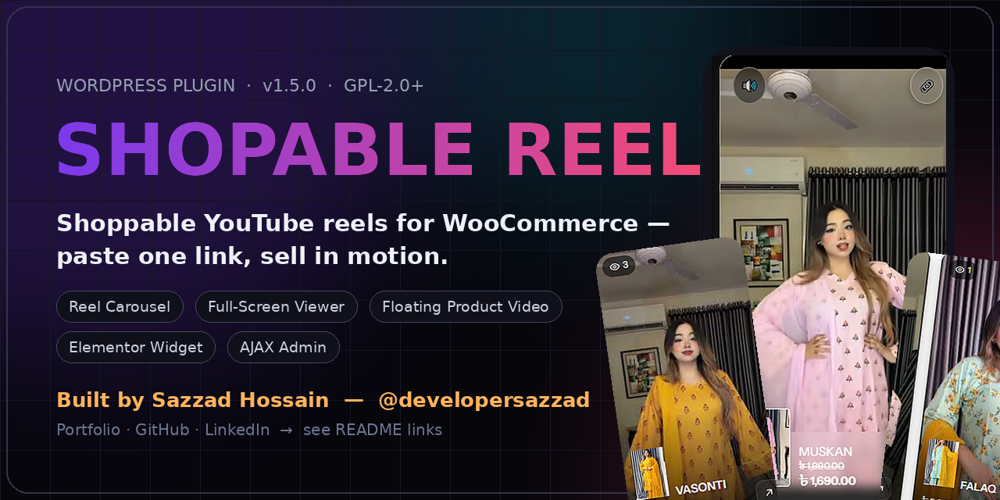
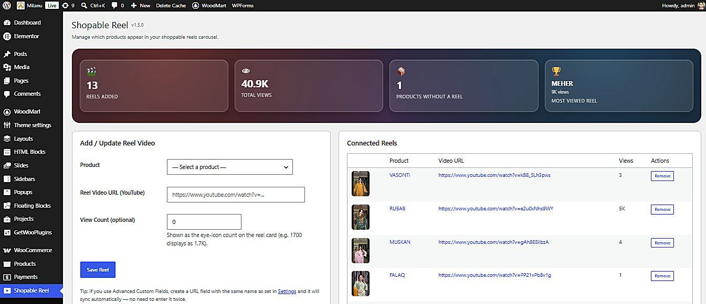
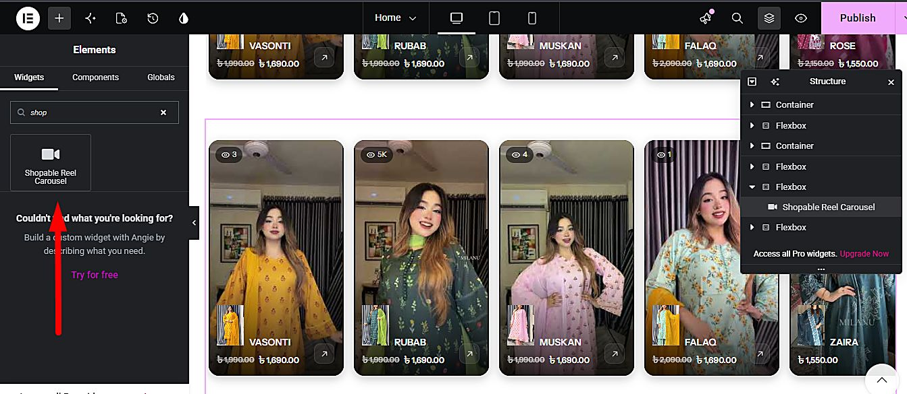
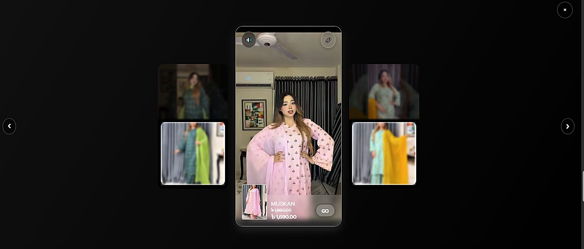
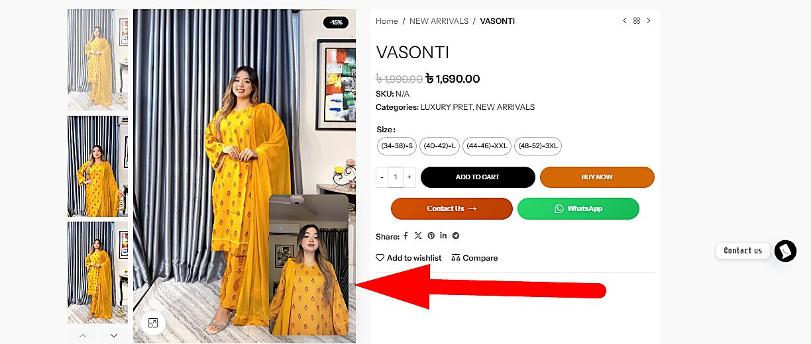
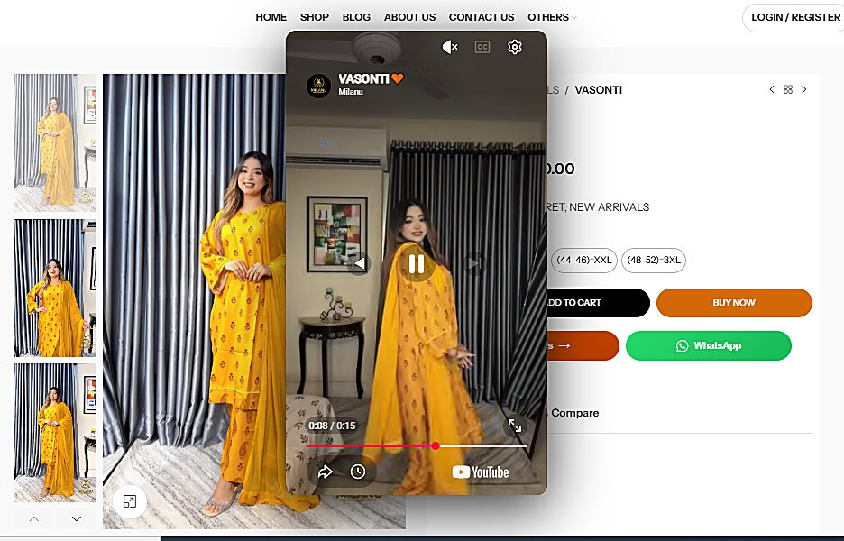
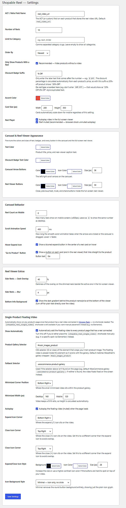
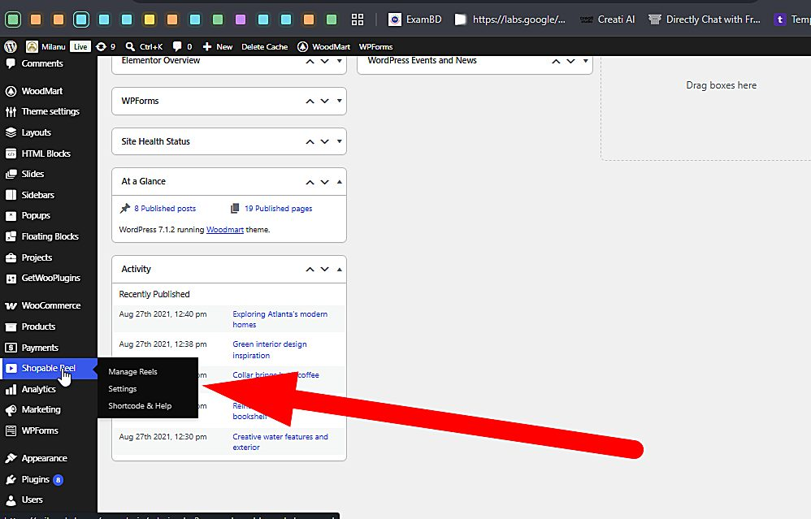

<p align="center">
  
</p>

<p align="center">
  <a href="https://github.com/developersazzad"></a>
  <a href="https://wordpress.org"></a>
  <a href="https://www.php.net"></a>
  <a href="https://www.gnu.org/licenses/gpl-2.0.html"></a>
</p>

<p align="center">
  <a href="https://woocommerce.com"></a>
  <a href="#-elementor--shortcode"></a>
  <a href="#-architecture--ajax-endpoints"></a>
  <a href="#-screenshots"></a>
  
</p>

<h1 align="center">Shopable Reel 🎬🛍️</h1>
<p align="center">
  <b>Turn YouTube reels into shoppable video carousels for WooCommerce.</b><br>
  Paste one YouTube link per product — get a swipeable reel carousel, a full-screen immersive viewer,<br>
  and a floating draggable video that follows shoppers inside the product gallery.
</p>

<p align="center">
  <a href="https://sazzad.wedevspro.com/case_stady/shopable-reel-case-study/">🌐 Portfolio & Case Study</a> ·
  <a href="#-installation">⚡ Quick Start</a> ·
  <a href="#-shortcode-reference">📖 Shortcode Docs</a> ·
  <a href="#-comparison">🆚 vs ReelUp</a> ·
  <a href="#-author">👨‍💻 Author</a>
</p>

---

## 🧭 Table of Contents

- [✨ Why Shopable Reel?](#-why-shopable-reel)
- [🚀 Features](#-features)
- [🔁 How It Works](#-how-it-works)
- [📸 Screenshots](#-screenshots)
- [📦 Installation](#-installation)
- [🎛 Admin Screens](#-admin-screens)
- [🧩 Elementor & Shortcode](#-elementor--shortcode)
- [📖 Shortcode Reference](#-shortcode-reference)
- [🧠 Architecture & AJAX Endpoints](#-architecture--ajax-endpoints)
- [⚡ Performance Budget](#-performance-budget)
- [🆚 Comparison](#-comparison)
- [🗺 Roadmap](#-roadmap)
- [🤝 Contributing & Support](#-contributing--support)
- [👨💻 Author](#-author)
- [📄 License](#-license)

---

## ✨ Why Shopable Reel?

Social commerce trained your customers to **swipe & watch**, not scroll image galleries.
Paid apps like **ReelUp** (Shopify-only, monthly fee) and **Ecomm Reels** (limited control)
solve this elsewhere — **Shopable Reel** brings it to WordPress, **free**, with more control:

> 💡 **One YouTube link per product.** The plugin assembles the rest:
> carousel → full-screen viewer → floating product-page video.

- 🆓 **Free & self-owned** — no subscription, no platform lock-in
- 🧩 **Native Elementor widget** with every control live in the canvas
- 🎈 **Floating product video** — a feature paid competitors don't have
- ⚡ **100% AJAX admin** — save, remove, track: zero page reloads
- 🔒 **WordPress-native security** — nonces, capability checks, `esc_*` everywhere
- 📱 **Mobile-first** — separate reel counts & card sizes for mobile

---

## 🚀 Features

| | Feature | Details |
|---|---|---|
| 🎠 | **Reel Carousel** | Horizontal scroll-snap row: view-count badge, auto discount badge (`-15%` math), price, product thumb |
| 📱 | **Full-Screen Viewer** | 9:16 stage, side reels dimmed (40%) + blurred (4px), mute, copy-link, prev/next, brand header |
| 🎈 | **Floating Product Video** | Draggable PiP inside the gallery, minimize to corner, expand to centered 9:16 player |
| 🎛 | **Manage Reels Dashboard** | Stats strip (reels · total views · missing reels · top reel) + connected-reels table |
| ⚙️ | **Settings Design System** | 20+ controls: colors, icon sizes, card size, scroll speed, overlays, corners, badge suffix |
| 🧩 | **Elementor Widget** | “Shopable Reel Carousel” — every attribute as a live control |
| ⌨️ | **Power Shortcode** | `[shopable_reel_devsazzad]` + 15 optional attributes with Settings fallback |
| 🔗 | **ACF Auto-Sync** | URL field named `reel_video_url` syncs reels without double entry |
| 📈 | **View Analytics** | Eye-badge counts (`1700 → 1.7K`), counted once per session on real plays |
| 📖 | **In-Admin Docs** | “Shortcode & Help” screen — documentation that kills support tickets |
| 🔒 | **Secure AJAX Core** | `admin-ajax` endpoints with nonces + capability checks |
| 🌐 | **i18n & BDT Ready** | Translation-wrapped strings, `৳` price formatting |

---

## 🔁 How It Works

```
 1️⃣  CONNECT     WP Admin → Shopable Reel → Manage Reels
                 pick product ▸ paste YouTube URL ▸ (optional views) ▸ Save  [AJAX]
                          ↓
 2️⃣  CONFIGURE   Settings: counts, categories, colors, card size, player rules,
                 viewer overlays, floating-video corners  ·  docs in Shortcode & Help
                          ↓
 3️⃣  PUBLISH     [shopable_reel_devsazzad]  or  drag the Elementor widget anywhere
                          ↓
 4️⃣  SHOP        carousel tap → full-screen viewer → “Go” → product page
                 → floating draggable video hovering the gallery (expand = 9:16 player)
```

No video attached to a product? **Nothing renders.** Zero cost, zero clutter.

---

## 📸 Screenshots

| | |
|:---:|:---:|
| <br>*Manage Reels — stats + connected reels* | <br>*Elementor widget, live canvas* |
| <br>*Full-screen viewer, dimmed side reels* | <br>*Floating video on product page* |
| <br>*Expanded 9:16 YouTube player* | <br>*Settings — the whole design system* |

---

## 📦 Installation

**From the repo (manual)**
1. Download / clone this repository as `shopable-reel.zip` (folder name `shopable-reel`)
2. WP Admin → **Plugins → Add New → Upload Plugin** → activate
3. A **Shopable Reel** menu appears with *Manage Reels · Settings · Shortcode & Help*

**Requirements**

| Requirement | Minimum |
|---|---|
| WordPress | 5.8 (tested to 7.1) |
| PHP | 7.4 |
| WooCommerce | 6.0 |
| Elementor | optional (widget auto-registers) |
| ACF | optional (auto-sync field) |

---

## 🎛 Admin Screens

| Screen | Purpose |
|---|---|
| **Manage Reels** | Bind products ↔ YouTube URLs, seed views, remove; live stats strip |
| **Settings** | Query rules · badge suffix · accent/text/arrow colors · card size · player rules · viewer dim/blur · mobile count · scroll speed · floating-video selectors & corners |
| **Shortcode & Help** | In-admin manual: shortcode, attribute table, Elementor guide, floating-video behaviour |



---

## 🧩 Elementor & Shortcode

**Elementor:** search **“Shopable Reel Carousel”** in the widget panel → drag onto any section.
Every Settings control exists as a widget control with live preview.

**Shortcode (minimal):**
```text
[shopable_reel_devsazzad]
```

**Shortcode (full power):**
```text
[shopable_reel_devsazzad limit="8" limit_mobile="4" category="lawn,bridal"
 orderby="popularity" scroll_speed="400" show_go_button="yes" go_button_text="Shop Now"
 accent_color="#ff4d6d" card_width="220" card_height="380"]
```

**Single-product floating video (manual placement):**
```text
[shopable_reel_single_video]
```

---

## 📖 Shortcode Reference

| Attribute | Default | Description |
|---|---|---|
| `limit` | Settings | Reels to show on desktop |
| `limit_mobile` | desktop | Reels on ≤600px screens (omit = same as desktop) |
| `category` | all | Comma-separated product category slugs |
| `orderby` | `newest` | `date` · `popularity` · `price` · `title` · `rand` |
| `scroll_speed` | `450` | Smooth-scroll duration in ms |
| `show_go_button` | `yes` | `yes` / `no` — “Go to product” on cards & viewer |
| `go_button_text` | `Go` | Label for that button |
| `text_color` | Settings | Product title / price / caption hex |
| `accent_color` | Settings | Badge background hex |
| `badge_text_color` | Settings | Badge text hex |
| `arrow_bg_color` | Settings | Carousel nav arrow background |
| `arrow_icon_color` | Settings | Carousel nav arrow icon |
| `arrow_size` | `36` | Nav arrow size in px |
| `card_width` | `200` | Card width in px (this instance only) |
| `card_height` | `350` | Card height in px (this instance only) |

---

## 🧠 Architecture & AJAX Endpoints

```
 WP Admin screens ──AJAX (nonce+sanitize)──▸ admin-ajax.php ──▸ post_meta / options
        ▲                                                          │
        │                                                          ▼
 YT IFrame API events ◂── frontend render ◂── WP_Query ◂── _sr_video_url · _sr_views
 (PLAYING → sr_track_view, once per session)
```

| Endpoint | Privilege | Purpose |
|---|---|---|
| `wp_ajax_sr_save_reel` | admin | Create/update product ↔ reel binding |
| `wp_ajax_sr_remove_reel` | admin | Delete a binding |
| `wp_ajax_sr_get_reels` | front | Fetch reel JSON for carousel/viewer |
| `wp_ajax_nopriv_sr_track_view` | front | Increment view count on first real play |

**Storage:** `_sr_video_url`, `_sr_views` post meta + one `sr_settings` option row.
No custom tables → upgrade-safe, export-safe, backup-safe.

**Developer hooks:** `sr_carousel_args` (filter query args) · `sr_reel_card_html` (filter card markup) · `sr_viewer_overlays` (filter dim/blur values).

---

## ⚡ Performance Budget

- 🚫 **Zero added bytes** on pages without reels (conditional enqueues)
- 🎬 YouTube iframes **created lazily** on first viewer open
- 🔇 Autoplay starts **muted** (browser policy compliant)
- 🖥 Carousel is **server-rendered** — zero-JS first paint, SEO-friendly
- 👁 Views de-duplicated per session via `sessionStorage`

---

## 🆚 Comparison

| Capability | **Shopable Reel** | ReelUp (Shopify) | Ecomm Reels (WP) |
|---|:---:|:---:|:---:|
| Platform | **WooCommerce / WP** | Shopify only | WordPress |
| Pricing | **Free** | Monthly subscription | Freemium |
| Elementor widget | ✅ | ❌ | ❌ |
| Full-screen viewer w/ dimmed side reels | ✅ | ✅ | basic |
| Floating product-page video | ✅ draggable | ❌ | ❌ |
| Mobile reel-count control | ✅ | ❌ | ❌ |
| Shortcode attributes | **15+** | n/a | few |
| In-admin documentation | ✅ | external | external |
| AJAX admin | ✅ nonce-secured | ✅ | partial |

---

## 🗺 Roadmap

- [ ] Gutenberg block parity with the Elementor widget
- [ ] Self-hosted MP4 / TikTok source support
- [ ] Per-reel CTA buttons & coupon deep-links
- [ ] GA4 / Meta Pixel view events
- [ ] REST namespace `shopable-reel/v2` for headless fronts
- [ ] Reel playlists / look-book grouping

---

## 🤝 Contributing & Support

1. Fork → branch (`feature/amazing`) → PR with screenshots & test steps
2. Issues: bug reports with WP/PHP versions + console output welcome
3. Support & custom work: [portfolio](https://sazzad.wedevspro.com/) · [LinkedIn](https://www.linkedin.com/in/developer-sazzad)

---

## 👨💻 Author

<p>
  
  <b>Sazzad Hossain — <code>developersazzad</code></b><br>
  Full-Stack Web Developer · Chattogram, Bangladesh<br>
  WordPress / WooCommerce plugin architecture · PHP · MySQL · JavaScript ES6 · AJAX & REST ·
  Elementor Widget API · YouTube IFrame API · MERN stack · CSS3 3D & performance engineering
</p>

| 🌐 Portfolio | 🐙 GitHub |  LinkedIn | ✉️ Email |
|---|---|---|---|
| [ai.khatifoodbazar.com/wa/portfolio](https://ai.khatifoodbazar.com/wa/portfolio/) | [github.com/developersazzad](https://github.com/developersazzad) | [linkedin.com/in/developer-sazzad](https://www.linkedin.com/in/developer-sazzad) | developersazzad7@gmail.com |

> This repo also ships an **interactive 3D case-study page** (`shopable-reel-case-study.html` +
> `index.html` source) — open it in a browser for the full product story, live demo & AJAX simulator.

---

## 📄 License

GPL-2.0-or-later — free to use, study, modify and share.
If it saves you a $29/mo subscription, ⭐ the repo and tell a merchant friend.

<p align="center"><sub>Made with ❤ and vanilla everything by <b>Sazzad Hossain</b> (@developersazzad) · © 2026</sub></p>
